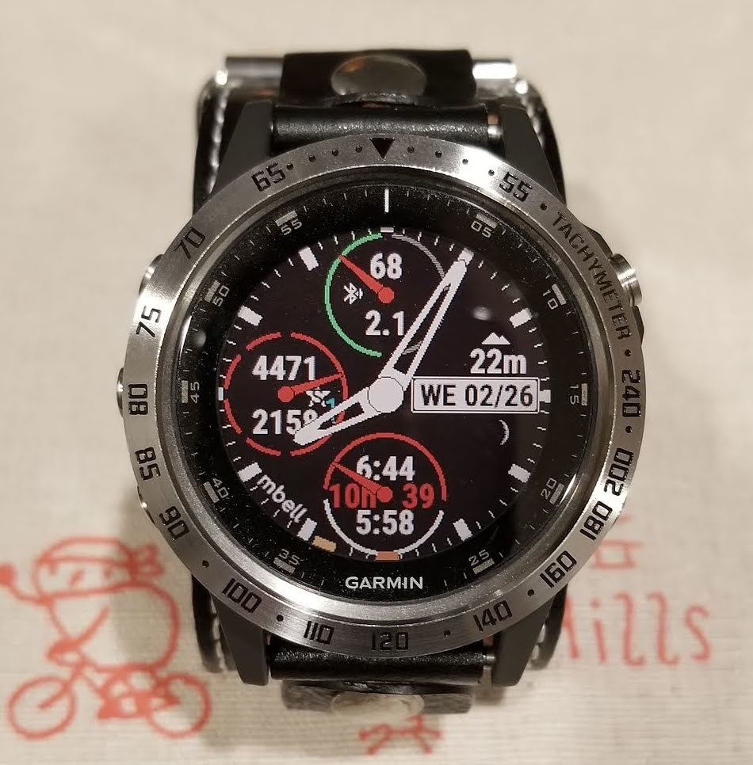
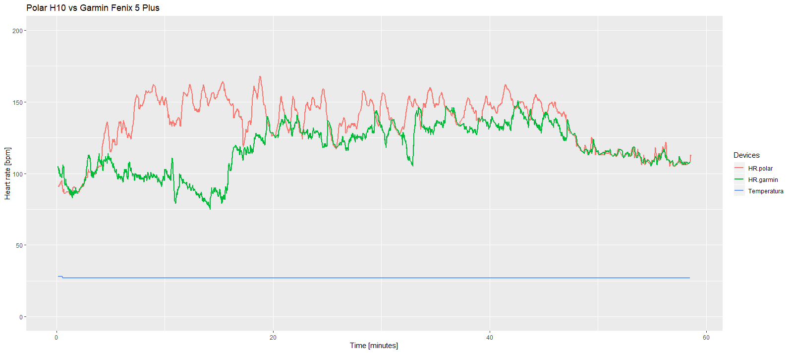

# Heart_rate-plot.r

The R script, plots the heart rate data to compare two devices. The input are CSV files. I attached two inputs files as example. Place garmin.csv and polar.csv in the same folder, edit the setwd("your_folder_location__") and run the script. The polar.csv comes from Polar H10 heart rate monitor which the device is placed in the chest with an elastic band. 

 

The garmin.csv comes from the Garmin watch Fenix 5 Plus, which use optic wrist technology.

The Polar H10 work with Polar Beat mobile app and the synchronization is via bluetooth. In the workout session the H10 store bpm data each second but the Fenix 5 stores bpm data at different intervals, check the examples files for more details. 

Definitely, the Polar H10 is better in workout session because the moisture in your skin helps the electrodes to get better contact. And the same moisture have a negative effects on sensor readings. Fortunately, you can synchronize the Fenix 5 with the Polar H10 and even use the Polar Beat app to store your heart rate data.

I extracted the garmin.csv from garmin.fit using a Python script "FIT_to_CSV_forWin.py" here is the link: https://github.com/rdchip/FIT-to-CSV-converter-for-windows  
